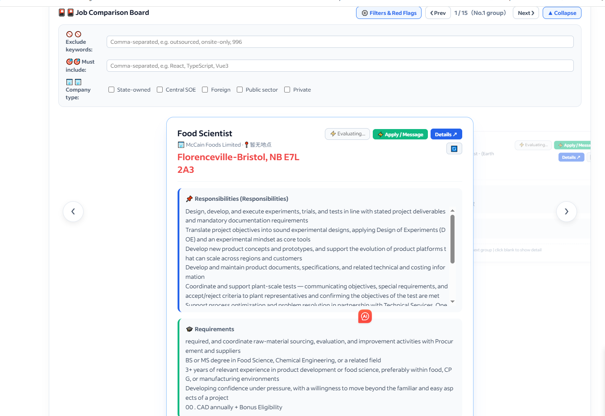
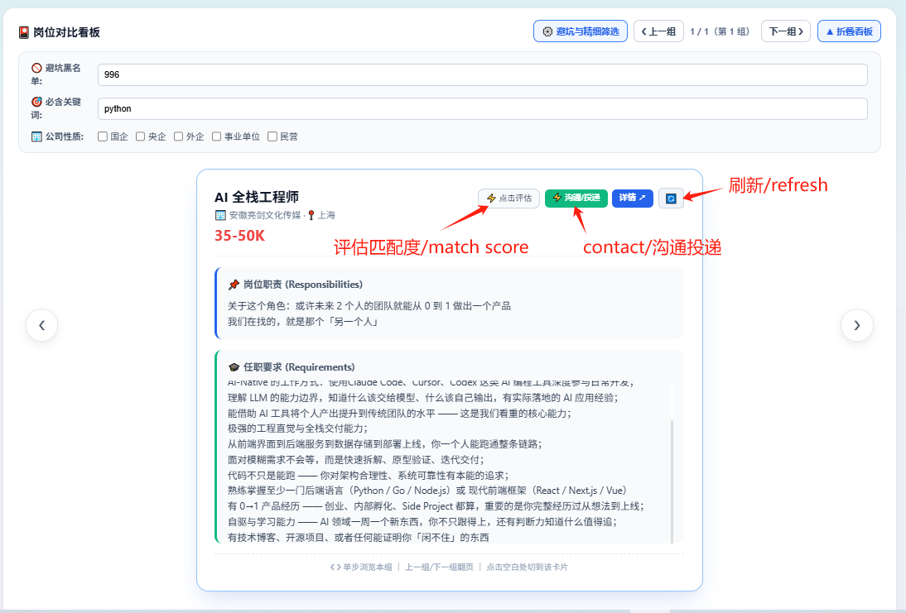
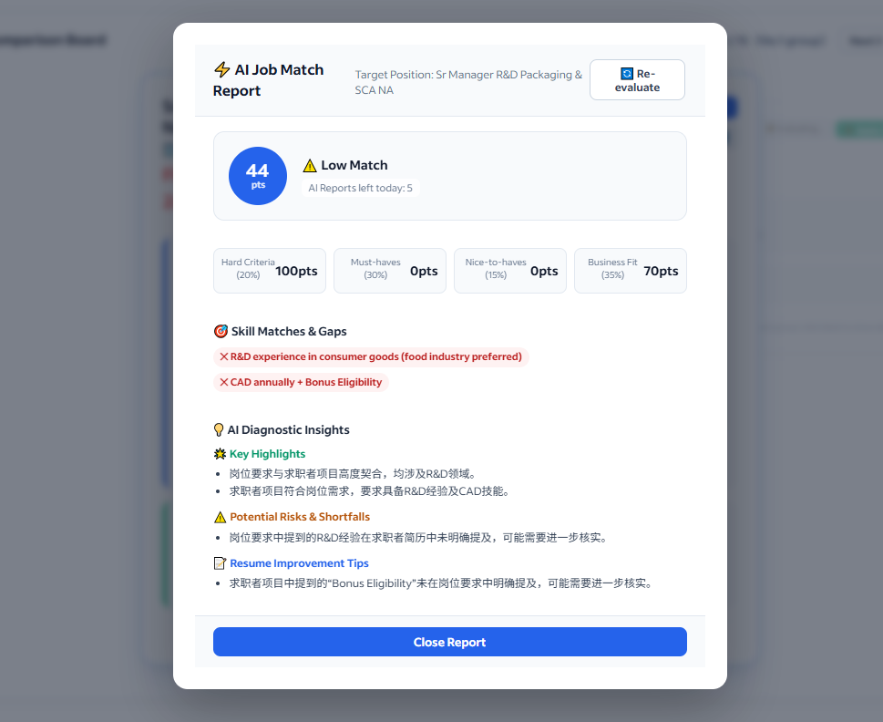
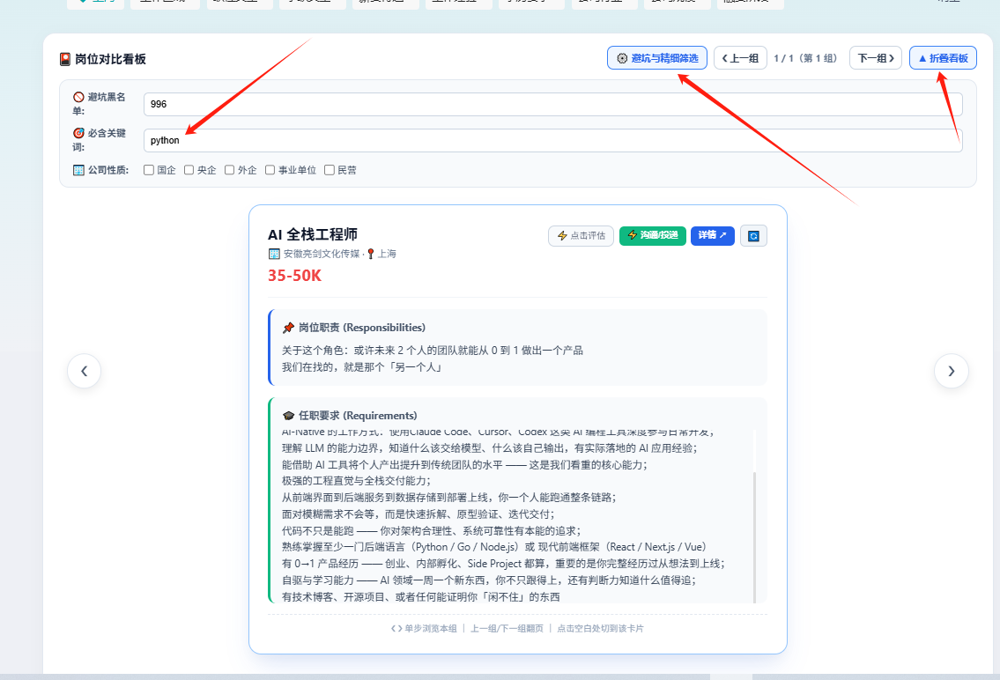
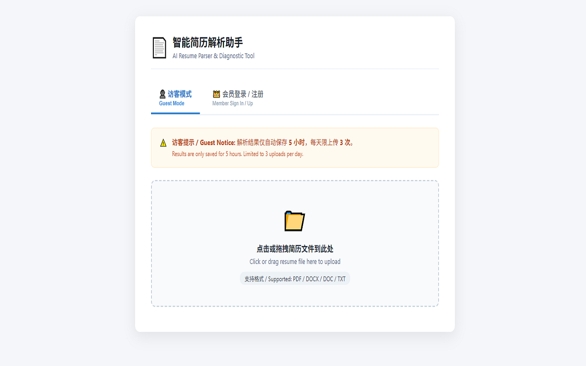

# Job-helper

> 在招聘网站里自动划出岗位职责与任职要求，比对你的简历，给出匹配度。

一个浏览器插件 + 后端服务。浏览职位列表时不用逐个点开，职责和要求直接展示在卡片上；上传一次简历，之后每个职位都会自动算出与你的匹配程度。

**官网**：https://job-helper.zhitree.top/　·
**反馈**：yizongyiheng@gmail.com



---

## 支持的平台

| 中文站点 | 海外站点 |
|---|---|
| BOSS直聘 · 猎聘 · 51job · 智联招聘 | LinkedIn · Indeed · Glassdoor · Monster · ZipRecruiter |

插件会自动识别当前站点，界面语言跟随站点切换——在 LinkedIn 上显示英文，在猎聘上显示中文。

---

## 功能

### 职位信息自动提取

不同招聘网站的页面结构差别很大，插件内部按平台适配，但展示给你的格式是统一的：岗位职责、任职要求分开列出，去掉了「立即沟通」「扫码下载」这类和职位无关的界面文字。


### 简历匹配度

上传一次简历，之后浏览的每个职位都会自动比对，给出一个匹配分数。分数由两部分组成——学历/年限/技能这类可以直接判断的硬性条件占大头，业务契合度由 AI 评估。



### 详细分析报告

对想深入了解的职位，可以生成一份完整报告：匹配亮点、能力缺口、简历修改建议、可能被追问的问题。



### 精细筛选

三个维度组合过滤，不符合的职位在原页面上直接变灰：

- **避坑关键词** —— 外包、驻场、996、单休等，命中即排除
- **必含关键词** —— 只看包含特定技术栈的职位
- **公司性质** —— 国企、央企、外企、事业单位、民营



### 访客模式


不注册也能用：每天可解析 3 次简历，结果保留 5 小时。够你判断这个工具是否适合自己，再决定要不要获取激活密钥。

### 完整视频
<video src="docs/screenshots/job_help_cover.mp4?raw=true" controls="controls" width="100%">
  您的浏览器不支持播放该视频
</video>
---

## 使用说明

### 1. 安装插件

从 Chrome 应用商店安装，或加载本地开发版：

```
chrome://extensions → 打开「开发者模式」→「加载已解压的扩展程序」→ 选择 extension/ 目录
```

安装后建议固定到工具栏，方便随时打开。

### 2. 上传简历

点击工具栏的插件图标，勾选隐私协议，上传简历文件（支持 PDF / DOCX / DOC / TXT）。

- **访客模式** —— 直接上传，每天 3 次，结果保留 5 小时
- **会员模式** —— 填入邮箱和激活密钥，简历永久保存，无次数限制

### 3. 浏览职位

打开任意支持的招聘网站，正常搜索职位。插件会在页面上方注入一个看板，展示提取出的职责、要求和匹配分数。

### 4. 设置筛选条件

点开「避坑与精细筛选」，填入你的关键词。设置会保存在本地，下次访问自动应用。

### 5. 获取激活密钥

访问[官网](https://job-helper.zhitree.top/)，输入邮箱 → 接收验证码 → 验证后自动生成密钥。密钥有效期 30 天，到期前一天内可重新获取。

---

## 项目结构

```
job-helper/
├── extension/                  浏览器插件（Manifest V3）
│   ├── manifest.json
│   ├── injected.js             运行在页面 MAIN world，拦截 fetch/XHR 响应
│   ├── content3.js             51job / 猎聘等「列表 + 新标签页」型站点
│   ├── test1.js                BOSS / LinkedIn / 智联等「分栏不跳转」型站点
│   ├── jd_parsed.js            职责/要求的文本切分规则引擎
│   ├── background1.js          后台服务，处理跨域请求与标签页捕获
│   ├── popup.html / popup.js   插件弹窗：简历上传、账号状态
│   └── content.css
│
└── backend/                    后端服务（部署在 Vercel）
    ├── server.js               路由入口
    ├── gateway.js              多后端 LLM 调用网关
    ├── telemetry.js            Token 用量与成本统计
    ├── checkuser.js            每日配额校验
    ├── console.html            用量统计控制台
    ├── public/                 官网静态页面
    │   ├── index.html
    │   ├── privacy.html        隐私政策
    │   ├── terms.html          服务条款
    │   └── security.html       安全声明
    ├── package.json
    └── vercel.json


### 两个 content script 的分工

`content3.js` 和 `test1.js` 看起来重复，实际服务的是两类交互模式完全不同的站点：

- **`test1.js`** —— BOSS、LinkedIn、智联：点击职位后在同一页面的右侧面板展示详情，不跳转
- **`content3.js`** —— 51job、猎聘：点击后打开新标签页，或需要单独请求详情页

取数策略因此完全不同，硬合并成一个文件反而会让两边都变复杂。

---

## 本地开发

### 后端

```bash
cd backend
npm install
cp .env.example .env    # 填入数据库、Redis、各 LLM 服务商的 Key
vercel dev              # 或 node server.js
```

必需的环境变量：

```bash
DATABASE_URL=postgresql://...      # PostgreSQL
REDIS_URL=redis://...              # Redis
ADMIN_API_KEY=...                  # 管理接口密钥
CONSOLE_PASSWORD=...               # 用量控制台密码

# LLM 服务商（至少配置一个）
DEEPSEEK_API_KEY=...
BAILIAN_API_KEY=...
ZHIPU_API_KEY=...
SILICONFLOW_API_KEY=...
GROQ_API_KEY=...
```

### 插件

修改插件代码后，在 `chrome://extensions` 点击刷新按钮重新加载。修改 `manifest.json` 必须重新加载扩展，只改 JS 的话刷新目标页面即可。

插件默认连接 `http://127.0.0.1:3000`，本地联调时确认 `content3.js` / `test1.js` 里的 `API_BASE_URL` 指向正确地址；部署后需要改成线上域名。

### 用量统计

后端跑起来后访问 `/api/console`，输入 `CONSOLE_PASSWORD` 查看 Token 消耗、API 调用次数、各模型成本分布，支持 7 天 / 1 个月 / 3 个月 / 1 年四个周期。

首次使用需要先建表：

```bash
curl -X POST http://localhost:3000/api/admin/init-telemetry -H "X-Admin-Key: 你的密钥"
```

---

## 技术栈

- **插件** —— 原生 JavaScript，Chrome Extension Manifest V3
- **后端** —— Node.js、Express、PostgreSQL、Redis、Zod
- **AI** —— 多后端 LLM 网关，支持 DeepSeek / 阿里云百炼 / 智谱 / SiliconFlow / Groq，自动按延迟和成本选择节点，故障时自动切换
- **部署** —— Vercel

---

## 隐私

- 简历数据仅用于解析和匹配，不出售给第三方
- 涉及个人信息的解析请求会避开条款中声明「可能用于模型训练」的服务商
- 插件的网页访问权限只用于识别职位信息，不读取密码、支付信息或与职位无关的页面内容

完整条款见[隐私政策](https://job-helper.zhitree.top/privacy.html)与[服务条款](https://job-helper.zhitree.top/terms.html)。

---

## 许可

本项目采用 [MIT License](LICENSE) 开源。

```
MIT License

Copyright (c) 2026 Job-helper

Permission is hereby granted, free of charge, to any person obtaining a copy
of this software and associated documentation files (the "Software"), to deal
in the Software without restriction, including without limitation the rights
to use, copy, modify, merge, publish, distribute, sublicense, and/or sell
copies of the Software, and to permit persons to whom the Software is
furnished to do so, subject to the following conditions:

The above copyright notice and this permission notice shall be included in all
copies or substantial portions of the Software.

THE SOFTWARE IS PROVIDED "AS IS", WITHOUT WARRANTY OF ANY KIND, EXPRESS OR
IMPLIED, INCLUDING BUT NOT LIMITED TO THE WARRANTIES OF MERCHANTABILITY,
FITNESS FOR A PARTICULAR PURPOSE AND NONINFRINGEMENT. IN NO EVENT SHALL THE
AUTHORS OR COPYRIGHT HOLDERS BE LIABLE FOR ANY CLAIM, DAMAGES OR OTHER
LIABILITY, WHETHER IN AN ACTION OF CONTRACT, TORT OR OTHERWISE, ARISING FROM,
OUT OF OR IN CONNECTION WITH THE SOFTWARE OR THE USE OR OTHER DEALINGS IN THE
SOFTWARE.
```

---

## 声明

Job-helper 不是招聘平台，与 LinkedIn、Indeed、BOSS直聘、猎聘、51job、智联招聘等平台无官方关联。匹配分数由 AI 生成，仅供参考，不代表招聘方的实际评价，也不预示面试或录用结果。
